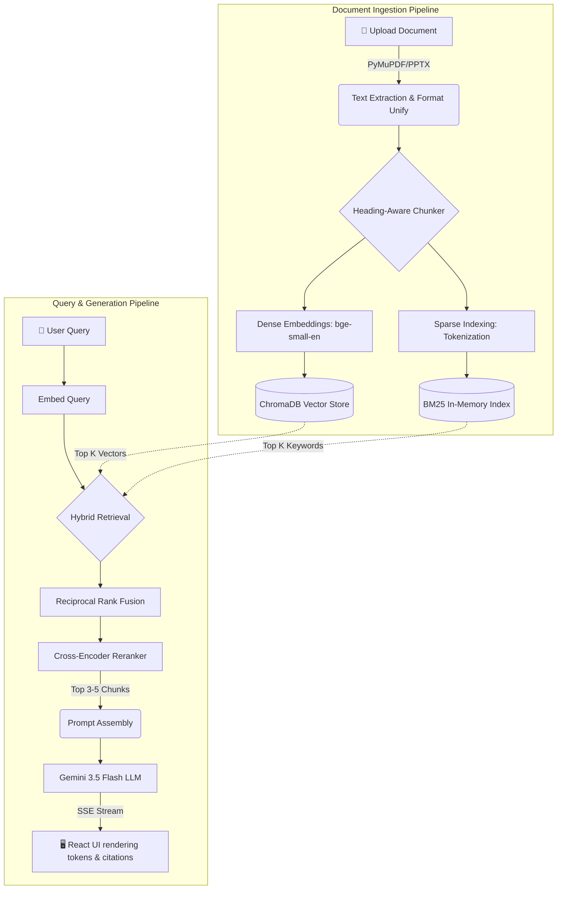

<div align="center">
  <h1>🎓 ScholarRAG</h1>
  <p><em>Advanced Hybrid Retrieval-Augmented Generation with Verifiable Citations</em></p>

  <p>
    
    
    
    
    
  </p>
</div>

---

## 📖 Executive Summary

**ScholarRAG** solves the inherent hallucination problem in Large Language Models by grounding generative responses entirely within your specific documents. Engineered for academics, legal professionals, and data-heavy researchers, it provides a seamless interface to upload complex documents and query them instantly.

Unlike standard RAG pipelines, ScholarRAG employs a **Hybrid Retrieval Strategy** backed by a **Cross-Encoder Reranker**, ensuring that the LLM is fed only the absolute highest-fidelity context. Every generated claim is mapped back to the source material with **verifiable page-level citations**.

---

## ✨ Core Features & Visual Breakdown

| Feature | Description | Technical Implementation |
| :--- | :--- | :--- |
|  **Hybrid Search** | Fuses meaning and exact keywords. | `ChromaDB` (Dense) + `BM25Okapi` (Sparse) via Reciprocal Rank Fusion (RRF). |
|  **Cross-Encoder** | Strict relevance filtering. | `BAAI/bge-reranker-base` dynamically re-orders results before LLM generation. |
|  **Smart Chunking** | Preserves document hierarchy. | Custom **heading-aware parent-child recursive chunker** preserving logical boundaries. |
|  **SSE Streaming** | Real-time AI interactions. | Native `fetch` with FastAPI `StreamingResponse` yielding tokens chunk-by-chunk. |
|  **Premium UI** | Stunning glassmorphism design. | React, TailwindCSS, Radix UI primitives, and dynamic animations. |

---

## 🏗️ System Architecture Flow

The pipeline is heavily decoupled, separating the heavy machine learning inference tasks from the instantaneous web rendering tasks.



---

## 🔬 Under the Hood: AI Models

ScholarRAG doesn't rely entirely on cloud APIs. It runs critical, privacy-centric models entirely on your local hardware for ingestion and retrieval:

1. **Embedding Layer (`BAAI/bge-small-en-v1.5`)**: 
   - A highly efficient, 384-dimensional dense model that requires < 500MB of RAM. Exceptional at grasping semantic relationships in English academic text.
2. **Reranking Layer (`BAAI/bge-reranker-base`)**: 
   - A Cross-Encoder. Instead of comparing two isolated vectors, it feeds the user query and the retrieved chunk through attention layers *simultaneously*, outputting a highly accurate 0.0–1.0 relevance score.
3. **Generative Layer (`gemini-3.5-flash`)**: 
   - Google's blazing-fast generative model, restricted by a rigid system prompt to only answer using provided context.

---

## 🛠️ Setup & Installation Guide

### Prerequisites
- **Python 3.11+**
- **Node.js 18+**
- **Google Gemini API Key** ([Get it here](https://aistudio.google.com/))

### 1. Backend Initialization (FastAPI)

Clone the repository and set up your Python environment:

```bash
git clone https://github.com/shreemsri/academicRag.git
cd academicRag

# Create and activate virtual environment
python -m venv venv
source venv/bin/activate  # On Windows: venv\Scripts\activate

# Install dependencies
pip install -r backend/requirements.txt
```

Create your `.env` configuration file in the project root:

```ini
# .env
DEFAULT_LLM_PROVIDER=gemini
GEMINI_API_KEY=your_secure_api_key_here
```

Boot the server:
```bash
uvicorn backend.app.main:app --host 0.0.0.0 --port 8001
```
*(Note: Initial startup will dynamically download the BAAI models from HuggingFace to your local cache).*

### 2. Frontend Initialization (React)

Open a secondary terminal:

```bash
cd frontend
npm install
npm run dev
```
Navigate to `http://localhost:5174` in your browser. You are now ready to upload and query!

---

## 📁 Repository Structure

<details>
<summary>Click to expand the full directory tree</summary>

```text
ScholarRAG/
├── backend/                  
│   ├── app/
│   │   ├── api/              # FastAPI Router endpoints
│   │   ├── core/             # Auth, Settings, Logging
│   │   ├── database/         # SQLite DB schemas and ChromaDB initialization
│   │   ├── ingestion/        # Document Parsing, Heading-Aware Chunkers
│   │   ├── retrieval/        # Dense (Vector) and Sparse (BM25) engines
│   │   ├── generation/       # Streaming LLM Interface (Gemini, OpenAI, Ollama)
│   │   └── main.py           # Application Entrypoint
│   └── requirements.txt      
│
├── frontend/                 
│   ├── src/
│   │   ├── components/       # Radix UI and custom glassmorphism components
│   │   ├── lib/              # Zustand stores, SSE fetch utilities
│   │   ├── App.tsx           
│   │   └── main.tsx          
│   ├── package.json          
│   └── tailwind.config.js    
│
├── .env                      # Secret Keys
├── documentation.md          # PDF Generator source
└── ScholarRAG_Documentation.pdf
```
</details>

---

## 🧪 Automated Testing

ScholarRAG ships with rigorous testing scripts to validate the pipeline:

- **`test_upload.py`**: Simulates the ingestion flow. Validates text extraction, chunking math, and ChromaDB vector commits.
- **`test_qa.py`**: Exercises the retrieval mechanisms (RRF math, cross-encoder scores) and verifies the SSE stream structure from Gemini.

Execute them directly:
```bash
source venv/bin/activate
python test_qa.py
```

---
<div align="center">
  <p>Built for the future of academic research. 🚀</p>
</div>
